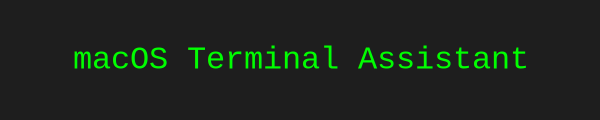

<p align="center">
  
</p>

<p align="center">
Ask natural-language questions about macOS Terminal commands.<br />
Get clean, copy-paste-ready CLI output instantly.
</p>

<p align="center">
  <a href="LICENSE">
    
  </a>
  <a href="https://www.python.org/">
    
  </a>
  <a href="https://astral.sh/uv">
    
  </a>
  <a href="https://platform.openai.com/docs">
    
  </a>
</p>

---

## 🧰 Requirements

- Python 3.8+
- [`uv`](https://astral.sh/uv/install) (for Python dependency management)
- OpenAI API key
- macOS (Zsh shell assumed)

---

## ⚡ Quick Start

```bash
git clone https://github.com/yourusername/macos-terminal-assistant.git
cd macos-terminal-assistant
uv sync
cp .env.example .env
# Edit .env and add your OpenAI API Key
```

---

## 📦 Installation (using `uv`)

1. Clone the project:

   ```bash
   git clone https://github.com/yourusername/macos-terminal-assistant.git
   cd macos-terminal-assistant
   ```

2. Sync dependencies using `uv`:

   ```bash
   uv sync
   ```

3. Create a `.env` file by copying the example file:

   ```bash
   cp .env.example .env
   ```

4. Edit the `.env` file and add your OpenAI API key:

   ```
   OPENAI_API_KEY=your-api-key-here
   ```

---

## 🧠 Setup: `ai` Command in Zsh

To easily call the assistant from anywhere, add the following function to your `~/.zshrc`:

1. Add the following function to your `~/.zshrc`:

   ```zsh
   function ai() {
     if [ $# -eq 0 ]; then
       echo "Usage: ai 'your terminal question here'"
       return 1
     fi

     (
       cd /Users/YOUR_USERNAME/macos-terminal-assistant || exit 1
       uv run main.py "$@"
     )
   }
   ```

   > Replace `/Users/YOUR_USERNAME/macos-terminal-assistant` with your actual full path.

2. Reload your terminal:

   ```bash
   source ~/.zshrc
   ```

---

## 🚀 Usage

Ask terminal-related questions like this:

```bash
$ ai "How do I list all files including hidden ones?"
ls -la
```

```bash
$ ai "How to show disk usage in human-readable format?"
du -sh *
```

✅ GPT responses are automatically cleaned — plain terminal commands without markdown or extra formatting.

---

## 🧼 System Prompt (in `main.py`)

The LLM is instructed to:

- Output only terminal commands
- Avoid backticks, markdown formatting, or explanations
- Assume Zsh on macOS Ventura or later

---

## 🛠 Project Structure

```
macos-terminal-assistant/
├── main.py        # Entry point script
├── .env           # Stores your OpenAI key
├── pyproject.toml # UV-managed project config
└── README.md      # You're here
```

---

## 🧠 Customization

### 🔄 Change the Model

You can change the OpenAI model used in `main.py` by modifying the `model` parameter (default is `"gpt-4o"`). Supported text models include:

- `gpt-4.1`
- `gpt-4.1-mini`
- `gpt-4.1-nano`
- `o4-mini`
- `o3-mini`
- `gpt-4o`
- `gpt-4o-mini`

Edit the line in `main.py`:

```python
model="gpt-4o"  # change this to another supported model if needed
```

### 🛠 Modify the System Prompt

To adjust the assistant's behavior (e.g., make it verbose or use a different shell), edit the `system_prompt` string inside `main.py`.

---

## ❓ Troubleshooting

- **Command not found?**  
  Ensure the `ai()` function is added to `.zshrc` and sourced.

- **Doesn't work outside the project folder?**  
  The `ai` function uses `cd` into the project directory so it works globally.

- **Missing packages?**  
  Run `uv sync` again to install dependencies.

--- 
